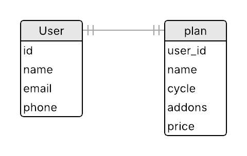

# MULTI STEP FORM


## <b>📖 Project description</b>

This a multi-step form application based on [Frontend Mentor Design](https://www.frontendmentor.io/challenges/multistep-form-YVAnSdqQBJ) where you can fill out a multi-step form simulating a signature to a plan for some digital service.

## <b>✨ Project features</b>

- Complete each step of the sequence
- Go back to a previous step to update their selections
- See a summary of their selections on the final step and confirm their order
- View the optimal layout for the interface depending on their device's screen size
- See hover and focus states for all interactive elements on the page
- See a responsive layout app for mobile, tablets and desktop screens
- Persistence in `localStorage` to prevent data loss on reload 
- Save data already filled on the form in browser local storage to prevent missing data from page relaod
- Receive form validation messages if:
  - A field has been missed
  - The email address is not formatted correctly
  - A step is submitted, but no selection has been made
- Feedback for server‑side errors (HTTP requests)

## <b>📚 Libraries</b>

#### **Frontend Stack**

| Library | Usage |
|---------|-------|
| [React](https://react.dev/learn) | Build UI components |
| [React Router](https://reactrouter.com/home) | SPA routing/navigation |
| [React Hook Form](https://www.react-hook-form.com/api/useform/) | Form validation and management |
| [Zod](https://zod.dev/) | Schema-based validation with RHF |
| [Zustand](https://zustand.docs.pmnd.rs/getting-started/introduction) | Global state + localStorage |
| [Vercel](https://vercel.com/docs) | Simulate serverless env (dev) |
| [Sass](https://sass-lang.com/documentation/) | Enhanced CSS styling |
| [Crypto JS](https://www.npmjs.com/package/crypto-js) | Encrypt localStorage data |
| [dotenv](https://www.npmjs.com/package/dotenv) | Load env vars (serverless) |
| [clsx](https://www.npmjs.com/package/clsx) | Conditional class management |

#### **Backend Stack**

| Library | Usage |
|-------- |-------|
| [Express](https://expressjs.com/en/starter/installing.html) | HTTP server + routes |
| [SQLite](https://www.sqlite.org/index.html) | Lightweight local DB |
| [sqlite3](https://www.npmjs.com/package/sqlite3) | DB connection (SQL) |
| [short-uuid](https://www.npmjs.com/package/short-uuid) | Compact UUID generation |
| [cors](https://www.npmjs.com/package/cors) | Enable CORS for frontend |
| [dotenv](https://www.npmjs.com/package/dotenv) | Load env vars in backend |

## 🛠️ Database

**Database Diagram**


- **User** (`id`, `name`, `email`, `phone`)  
- **Plan** (`user_id` → `User.id`, `name`, `cycle`, `addons`, `price`)  
- 1:1 relationship between User and Plan (each user has exactly one plan).

## 🚀 Getting Started

You can use the app in production mode directly through this [link](https://multi-step-form-two-theta.vercel.app/) or you can run it locally by following the steps below:

### Prerequisites

- **Node.js** ≥ v16
- **npm** or **yarn**  
- No external database installation required (SQLite is included)

### Installation

1. **Clone the repository**  
   ```bash
   git clone https://github.com/Gabrield7/multi-step-form.git
   cd multi-step-form
   ```

2. **Copy environment files**  
   ```bash
   cp backend/.env.example backend/.env
   cp frontend/.env.example frontend/.env
   ```

3. **Install dependencies**
   ```bash
   # Backend
   cd backend
   npm install

   # Frontend
   cd Frontend
   npm install
   ```

### Running in Development

   ```bash
   # Backend
   cd Backend
   npm run dev # starts Express on :3001

   # Frontend
   cd Frontend
   npm run dev # starts Vite on :5173
   ```

### Vercel Dev Middleware

To simulate production behavior locally, we use `vercel dev` as a proxy:

- It routes frontend `/api/...` requests to backend (`localhost:3001`)
- It automatically adds `x-api-key` to headers
- It mimics Vercel's serverless behavior for deploy testing

To run:
```bash
cd Frontend
vercel dev # starts vercel env on :3000
```

<b>OBS.:</b> 
1. Requires `vercel login` beforehand.

2. You'll only be able to run the app locally if the three servers mentioned are running simultanly.

Open your browser at http://localhost:5173 (or locahost link provided by vite) to view the app.

## 📡 API Endpoints

If you want to test the server directly through its endpoints, check the tables below

### 👤 User Endpoints

| Method   | Endpoint           | Description                                              |
|:---------|:-------------------|:---------------------------------------------------------|
| GET      | `/users`           | Get all available users                                  |
| GET      | `/user/:id`        | Get user individually by ID                              |
| GET      | `/users/check`     | Check if email and/or phone is already registerd         |
| PUT      | `/users/:id`       | Update any user data                                     |
| DELETE   | `/users/:id`       | Delete an individual user from Database by ID            |

<b>OBS.:</b> By deleting a user, its correponding plan is also deleted from plans table from database.

### 📦 Plan Endpoints

| Method | Endpoint        | Description                     |
|--------|-----------------|---------------------------------|
| GET    | `/plans`        | Get all available plans         |
| GET    | `/plans/:id`    | Get plans individually by ID    |
| PUT    | `/users/:id`    | Update any plan data            |

### 🧾 Register Endpoints

| Method | Endpoint        | Description                                                         |
|--------|-----------------|---------------------------------------------------------------------|
| GET    | `/register`     | Get all available Registers (User + Plans)                          |
| POST   | `/register`     | Endpoint used by Frontend to subscribe user and plan simultainly    |

### ⚠️ Testing‑Only Endpoints

| Method | Endpoint  | Description                          |
| ------ | --------- | ------------------------------------ |
| DELETE | `/users`  | Delete all users/plans |


## <b>📝 Extra details</b> 

- This is my first React and Typescript project using vite technology;
- It is also the first Frontend-end project with full backend integration, using developemnt and production enviroments;
- The Frontend was published on [Vercel](https://vercel.com/docs) and Backend (including sqlite database) published on [Railway](https://railway.com);

## <b>💻 Technologies used</b>

<p>
  
  
        
  
  
      
  
          
</p>

## <b>🌐 Access</b>

You can access the project page on the this [link](https://multi-step-form-two-theta.vercel.app/) or access the [project files](https://github.com/Gabrield7/multi-step-form) in github.

## Developed by Gabriel Luiz 🚀
**Contact**: gabrieldantas503@gmail.com<br>
**LinkedIn**: https://www.linkedin.com/in/gabdn/
